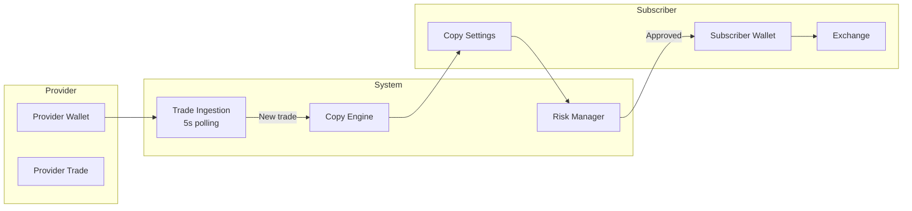
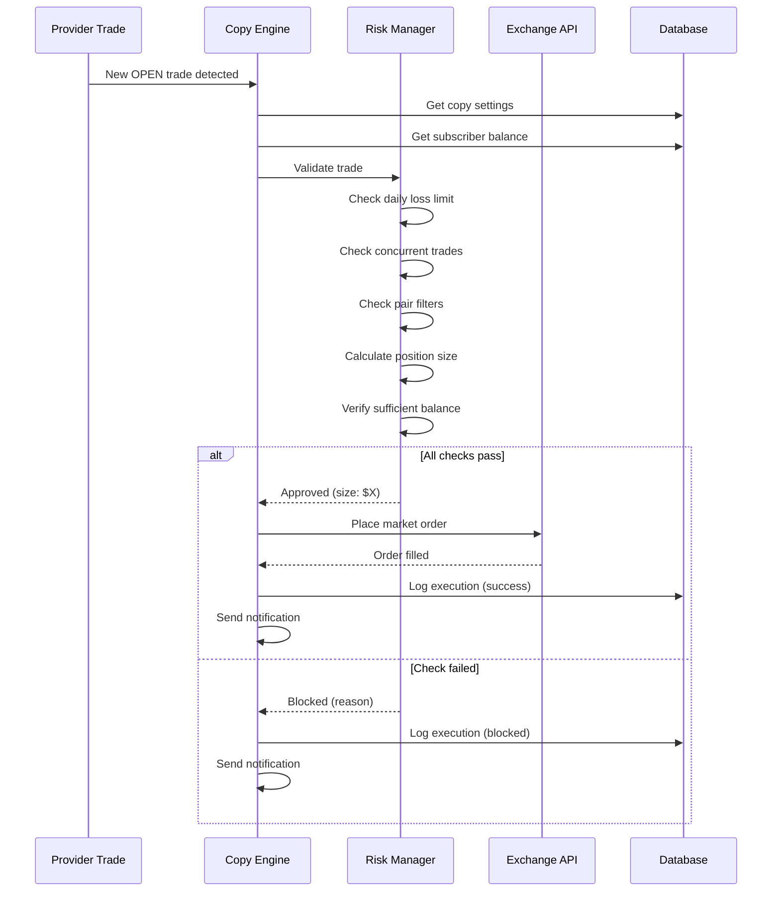

# Copy-Trading Documentation

This guide covers the complete copy-trading system, including setup, configuration, risk management, and troubleshooting.

## Overview

Copy-trading allows subscribers to automatically mirror trades from signal providers. When a provider opens, modifies, or closes a position, the same action is executed on the subscriber's connected wallet.

## How It Works



## Copy Modes

### 1. Proportional Mode

Mirrors the exact percentage of balance the provider uses.

| Provider | Subscriber |
|----------|------------|
| Balance: $100,000 | Balance: $10,000 |
| Trade size: $5,000 (5%) | Trade size: $500 (5%) |

**Best for:** Subscribers who want to match the provider's risk profile exactly.

### 2. Fixed Percent Mode

Always uses a fixed percentage of your balance per trade, regardless of provider's sizing.

| Provider | Subscriber |
|----------|------------|
| Trade size: Any | Trade size: 2% of balance |

**Best for:** Subscribers who want consistent position sizing.

### 3. Fixed Size Mode

Always uses a fixed dollar amount per trade.

| Provider | Subscriber |
|----------|------------|
| Trade size: Any | Trade size: $100 |

**Best for:** Subscribers with small accounts or those testing the system.

## Configuration Options

### Copy Settings Schema

```typescript
interface CopySettings {
  // Basic settings
  copy_mode: 'proportional' | 'fixed_percent' | 'fixed_size';
  size_percent?: number;      // For fixed_percent mode (1-100)
  size_fixed_usdt?: number;   // For fixed_size mode

  // Risk controls
  max_position_percent: number;  // Max % of balance per trade (default: 5)
  max_concurrent_trades: number; // Max open positions (default: 3)
  max_daily_loss_percent: number; // Pause if daily loss exceeds (default: 10)
  risk_multiplier: number;       // Scale positions (0.5 - 2.0, default: 1.0)

  // Filters
  pairs_whitelist: string[] | null; // Only copy these pairs (null = all)
  pairs_blacklist: string[];        // Never copy these pairs

  // SL/TP settings
  mirror_sl: boolean;  // Copy provider's stop loss
  mirror_tp: boolean;  // Copy provider's take profit

  // State
  is_paused: boolean;  // Manually paused by user
}
```

### Example Configurations

#### Conservative Copier
```json
{
  "copy_mode": "fixed_percent",
  "size_percent": 1,
  "max_position_percent": 2,
  "max_concurrent_trades": 2,
  "max_daily_loss_percent": 5,
  "risk_multiplier": 0.5,
  "mirror_sl": true,
  "mirror_tp": true
}
```

#### Aggressive Copier
```json
{
  "copy_mode": "proportional",
  "max_position_percent": 10,
  "max_concurrent_trades": 5,
  "max_daily_loss_percent": 20,
  "risk_multiplier": 1.5,
  "mirror_sl": true,
  "mirror_tp": false
}
```

#### BTC-Only Copier
```json
{
  "copy_mode": "fixed_size",
  "size_fixed_usdt": 500,
  "pairs_whitelist": ["BTC/USDT:USDT"],
  "mirror_sl": true,
  "mirror_tp": true
}
```

## Risk Management

### Automatic Safeguards

| Safeguard | Description | Default |
|-----------|-------------|---------|
| Max Position Size | Limits single trade size | 5% of balance |
| Max Concurrent | Limits open positions | 3 trades |
| Daily Loss Limit | Pauses copying if exceeded | 10% of balance |
| Insufficient Balance | Skips trade if not enough | Automatic |

### Daily Loss Tracking

The system tracks your daily P&L and automatically pauses copying if you exceed the daily loss limit:

```
Day starts: Daily P&L = $0
Trade 1 closes: -$50 → Daily P&L = -$50
Trade 2 closes: -$80 → Daily P&L = -$130
Trade 3 closes: -$100 → Daily P&L = -$230

If max_daily_loss = 10% and balance = $2000:
Max loss = $200

-$230 > $200 → COPYING PAUSED
```

Copying resumes automatically at midnight UTC, or you can manually unpause.

### Position Size Calculation

```typescript
function calculatePositionSize(
  providerTrade: Trade,
  settings: CopySettings,
  subscriberBalance: number
): number {
  let size: number;

  switch (settings.copy_mode) {
    case 'proportional':
      const providerPercent = providerTrade.size_usdt / providerTrade.balance * 100;
      size = subscriberBalance * (providerPercent / 100);
      break;

    case 'fixed_percent':
      size = subscriberBalance * (settings.size_percent / 100);
      break;

    case 'fixed_size':
      size = settings.size_fixed_usdt;
      break;
  }

  // Apply risk multiplier
  size *= settings.risk_multiplier;

  // Apply max position limit
  const maxSize = subscriberBalance * (settings.max_position_percent / 100);
  size = Math.min(size, maxSize);

  // Ensure minimum trade size (exchange dependent)
  const minSize = 5; // $5 minimum
  if (size < minSize) {
    throw new Error('Position size below minimum');
  }

  return size;
}
```

## Trade Execution Flow

### Opening a Position



### Closing a Position

When the provider closes a position:

1. System detects position closed
2. Finds all subscribers who copied this trade
3. Closes their positions at market price
4. Logs the execution and calculates P&L

### Modifying SL/TP

When the provider modifies stop loss or take profit:

1. System detects SL/TP change
2. If `mirror_sl` or `mirror_tp` is enabled:
   - Updates subscriber's position with new levels
3. Logs the modification

## Execution Logging

Every copy action is logged for audit purposes:

```typescript
interface CopyExecution {
  id: string;
  trade_id: string;           // Provider's trade
  subscription_id: string;
  wallet_id: string;
  action: 'open' | 'close' | 'update_sl' | 'update_tp';
  size: number;
  size_usdt: number;
  price: number;
  status: 'pending' | 'success' | 'failed' | 'blocked';
  error_message?: string;
  block_reason?: string;
  pnl_usdt?: number;          // Set on close
  executed_at: string;
}
```

### Viewing Execution History

Via API:
```bash
curl -X GET "https://api.qma-signals.com/api/v1/copy/executions?limit=50" \
  -H "Authorization: Bearer qma_live_xxxxx"
```

Via Dashboard: Navigate to Copy Trading → History

## Connecting Your Wallet

### Supported Exchanges

| Exchange | Status | Features |
|----------|--------|----------|
| Bitget | Supported | Futures, Spot |
| Binance | Coming Soon | - |
| Bybit | Coming Soon | - |

### API Key Requirements

Your exchange API key needs these permissions:

| Permission | Required | Purpose |
|------------|----------|---------|
| Read | Yes | Check balance, positions |
| Trade | Yes | Open/close positions |
| Futures | Yes | Trade futures contracts |
| Withdraw | **No** | Never enable this! |

### Security Best Practices

1. **Create a dedicated API key** for copy-trading only
2. **Never enable withdrawal** permissions
3. **Set IP whitelist** if your exchange supports it
4. **Use a sub-account** if available
5. **Start with small amounts** to test the system

### Connecting via Dashboard

1. Go to **Copy Trading → Connect Wallet**
2. Select your exchange (e.g., Bitget)
3. Enter your API credentials:
   - API Key
   - API Secret
   - Passphrase (if required)
4. Click **Verify Connection**
5. If successful, your wallet is connected

## Managing Copy Trading

### Pausing/Resuming

**Pause all copying:**
- Dashboard: Click "Pause Copying" button
- Effect: No new trades will be copied
- Existing positions: Remain open

**Resume copying:**
- Dashboard: Click "Resume Copying" button
- Note: Won't copy any trades that happened while paused

### Closing All Positions

**Emergency close:**
- Dashboard: Click "Close All Positions"
- Effect: Market closes all copied positions immediately
- Use when: You want to exit all trades NOW

### Removing a Provider

1. Go to **Copy Trading → Providers**
2. Find the provider
3. Click **Stop Copying**
4. Choose: Close positions or keep them open

## Troubleshooting

### Trade Not Copied

**Possible reasons:**

| Reason | Solution |
|--------|----------|
| Daily loss limit reached | Wait until next day or increase limit |
| Max concurrent trades reached | Close a position or increase limit |
| Pair blacklisted | Remove from blacklist |
| Pair not in whitelist | Add to whitelist or remove whitelist |
| Insufficient balance | Add funds or reduce position size |
| Position size below minimum | Increase size_percent or risk_multiplier |
| API key invalid | Reconnect wallet with valid keys |
| Copying paused | Resume copying |

### Execution Failed

Check the execution log for error details:

```bash
curl -X GET "https://api.qma-signals.com/api/v1/copy/executions?status=failed" \
  -H "Authorization: Bearer qma_live_xxxxx"
```

Common errors:

| Error | Meaning | Solution |
|-------|---------|----------|
| `INSUFFICIENT_BALANCE` | Not enough margin | Add funds |
| `POSITION_LIMIT_EXCEEDED` | Exchange position limit | Close positions |
| `INVALID_API_KEY` | API key revoked/expired | Reconnect wallet |
| `RATE_LIMITED` | Too many requests | Wait and retry |

### Position Size Mismatch

If your position size differs from expected:

1. Check your `risk_multiplier` setting
2. Check `max_position_percent` limit
3. Verify your balance is accurate

### Delayed Execution

Copy trades execute within 1-5 seconds of detection. Delays can occur due to:

- Exchange API latency
- High market volatility (requotes)
- Rate limiting

## FAQ

### Is my money safe?

Your funds remain in your exchange account at all times. We never have access to withdraw funds. All trading is done via your API key with trade-only permissions.

### What if the provider loses money?

You will also lose money proportionally. This is why:
- Research providers carefully
- Use conservative risk settings
- Set daily loss limits
- Only invest what you can afford to lose

### Can I close a position manually?

Yes! Go to your exchange and close any position. The system will detect it and update its records.

### What happens if I disconnect my wallet?

- Copying stops immediately
- Existing positions remain open on your exchange
- You can manage them manually or reconnect

### Are there fees for copy trading?

Subscription fee covers access. You also pay:
- Exchange trading fees (maker/taker)
- No additional copy-trading fees

### Can I copy multiple providers?

Yes! Each provider has independent settings. Be careful of:
- Overlapping positions (same pair from multiple providers)
- Combined risk exceeding your comfort level

---

## Support

- **Dashboard Help**: Click the ? icon on any setting
- **Email**: support@qma-signals.com
- **Discord**: [Join our community](https://discord.gg/qma-signals)
