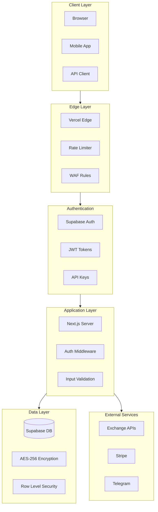

# Security Documentation

This document describes the security measures implemented in QMA SignalsHub.

## Overview

Security is paramount when dealing with trading systems and financial data. This platform implements multiple layers of security to protect user data, API credentials, and trading operations.

## Security Architecture



## Authentication

### User Authentication (Supabase)

- **Method**: Email/password or OAuth (Google, GitHub)
- **Session**: JWT tokens with 1-hour expiry
- **Refresh**: Automatic token refresh via `@supabase/ssr`
- **MFA**: Optional 2FA via authenticator app

### API Key Authentication

API keys are used for programmatic access:

```typescript
// Key format
qma_live_xxxxxxxxxxxxxxxxxxxxxxxxxxxxxxxx
qma_test_xxxxxxxxxxxxxxxxxxxxxxxxxxxxxxxx
```

**Security measures:**

1. **Hashing**: Keys are hashed (SHA-256) before storage
2. **Prefix storage**: Only the prefix (`qma_live_xxxx`) is stored for identification
3. **One-time display**: Full key shown only at creation
4. **Scoped permissions**: Keys can be limited to specific actions

**Key generation:**

```typescript
import crypto from 'crypto';

function generateApiKey(environment: 'live' | 'test'): {
  key: string;
  hash: string;
  prefix: string;
} {
  const randomBytes = crypto.randomBytes(32).toString('hex');
  const key = `sk_${environment}_${randomBytes}`;
  const hash = crypto.createHash('sha256').update(key).digest('hex');
  const prefix = key.substring(0, 12);

  return { key, hash, prefix };
}
```

**Key validation:**

```typescript
async function validateApiKey(providedKey: string): Promise<User | null> {
  const hash = crypto.createHash('sha256').update(providedKey).digest('hex');
  const prefix = providedKey.substring(0, 12);

  const { data: apiKey } = await supabase
    .from('api_keys')
    .select('*, user:profiles(*)')
    .eq('key_hash', hash)
    .eq('prefix', prefix)
    .single();

  if (!apiKey) return null;

  // Update last_used timestamp
  await supabase
    .from('api_keys')
    .update({ last_used_at: new Date().toISOString() })
    .eq('id', apiKey.id);

  return apiKey.user;
}
```

## Exchange Credential Security

Exchange API credentials (for copy-trading) require the highest level of protection.

### Encryption at Rest

All exchange credentials are encrypted using AES-256-GCM before storage:

```typescript
import crypto from 'crypto';

const ALGORITHM = 'aes-256-gcm';
const IV_LENGTH = 16;
const AUTH_TAG_LENGTH = 16;

export function encrypt(plaintext: string, key: string): string {
  const iv = crypto.randomBytes(IV_LENGTH);
  const keyBuffer = Buffer.from(key, 'hex');

  const cipher = crypto.createCipheriv(ALGORITHM, keyBuffer, iv);
  let encrypted = cipher.update(plaintext, 'utf8', 'hex');
  encrypted += cipher.final('hex');

  const authTag = cipher.getAuthTag();

  // Format: iv:authTag:ciphertext
  return `${iv.toString('hex')}:${authTag.toString('hex')}:${encrypted}`;
}

export function decrypt(ciphertext: string, key: string): string {
  const [ivHex, authTagHex, encrypted] = ciphertext.split(':');

  const iv = Buffer.from(ivHex, 'hex');
  const authTag = Buffer.from(authTagHex, 'hex');
  const keyBuffer = Buffer.from(key, 'hex');

  const decipher = crypto.createDecipheriv(ALGORITHM, keyBuffer, iv);
  decipher.setAuthTag(authTag);

  let decrypted = decipher.update(encrypted, 'hex', 'utf8');
  decrypted += decipher.final('utf8');

  return decrypted;
}
```

### Key Management

- **Encryption key**: Stored in environment variable (`ENCRYPTION_KEY`)
- **Key rotation**: Supported via re-encryption process
- **Access control**: Only server-side code can access encryption key

### Never Exposed to Client

Exchange credentials are **NEVER**:
- Sent to the browser
- Logged in any form
- Included in API responses
- Stored in cookies or local storage

All exchange operations happen server-side only.

## Webhook Security

### Payload Signing

All webhook payloads are signed using HMAC-SHA256:

```typescript
import crypto from 'crypto';

export function signWebhookPayload(
  payload: object,
  secret: string,
  timestamp: number
): string {
  const message = `${timestamp}.${JSON.stringify(payload)}`;
  return crypto
    .createHmac('sha256', secret)
    .update(message)
    .digest('hex');
}

// Headers sent with webhook
// X-Signature-256: sha256=xxxxxx
// X-Timestamp: 1705312800
```

### Signature Verification (Receiver)

```typescript
export function verifyWebhookSignature(
  payload: string,
  signature: string,
  timestamp: string,
  secret: string
): boolean {
  // Check timestamp is recent (within 5 minutes)
  const now = Math.floor(Date.now() / 1000);
  const webhookTime = parseInt(timestamp, 10);
  if (Math.abs(now - webhookTime) > 300) {
    return false; // Replay attack prevention
  }

  const message = `${timestamp}.${payload}`;
  const expected = 'sha256=' + crypto
    .createHmac('sha256', secret)
    .update(message)
    .digest('hex');

  return crypto.timingSafeEqual(
    Buffer.from(signature),
    Buffer.from(expected)
  );
}
```

### Webhook Security Headers

```
X-Signature-256: sha256=xxxxxxxxxxxxxxxxxxxxxxxxxxxxxxxx
X-Timestamp: 1705312800
Content-Type: application/json
User-Agent: QMA-SignalsHub-Webhook/1.0
```

## Database Security

### Row Level Security (RLS)

Supabase RLS ensures users can only access their own data:

```sql
-- Users can only read their own profile
CREATE POLICY "Users can view own profile"
ON profiles FOR SELECT
USING (auth.uid() = id);

-- Users can only read their own API keys
CREATE POLICY "Users can view own API keys"
ON api_keys FOR SELECT
USING (auth.uid() = user_id);

-- Users can only read their own subscriptions
CREATE POLICY "Users can view own subscriptions"
ON subscriptions FOR SELECT
USING (auth.uid() = user_id);

-- Providers can only see their own wallets
CREATE POLICY "Providers can view own wallets"
ON provider_wallets FOR SELECT
USING (
  provider_id IN (
    SELECT id FROM providers WHERE user_id = auth.uid()
  )
);
```

### Service Role Key

The service role key bypasses RLS and is used only for:
- Background jobs (cron)
- Admin operations
- Cross-user operations (copy-trading execution)

**Never exposed to client-side code.**

## Input Validation

### Zod Schema Validation

All API inputs are validated using Zod schemas:

```typescript
import { z } from 'zod';

export const createWebhookSchema = z.object({
  url: z.string().url().startsWith('https://'),
  events: z.array(z.enum([
    'signal.created',
    'trade.opened',
    'trade.closed',
    'trade.updated',
    'copy.executed',
    'copy.failed'
  ])).min(1),
  secret: z.string().min(16).max(128)
});

export const copySettingsSchema = z.object({
  copy_mode: z.enum(['proportional', 'fixed_percent', 'fixed_size']),
  size_percent: z.number().min(0.1).max(100).optional(),
  size_fixed_usdt: z.number().min(5).max(1000000).optional(),
  max_position_percent: z.number().min(0.1).max(100).default(5),
  max_concurrent_trades: z.number().int().min(1).max(20).default(3),
  max_daily_loss_percent: z.number().min(1).max(100).default(10),
  risk_multiplier: z.number().min(0.1).max(5).default(1),
  pairs_whitelist: z.array(z.string()).nullable().default(null),
  pairs_blacklist: z.array(z.string()).default([]),
  mirror_sl: z.boolean().default(true),
  mirror_tp: z.boolean().default(true),
  is_paused: z.boolean().default(false)
});
```

### SQL Injection Prevention

- All database queries use Supabase client with parameterized queries
- No raw SQL concatenation
- Input sanitization before database operations

## Rate Limiting

### API Rate Limits

```typescript
import { Ratelimit } from '@upstash/ratelimit';
import { Redis } from '@upstash/redis';

const ratelimit = new Ratelimit({
  redis: Redis.fromEnv(),
  limiter: Ratelimit.slidingWindow(100, '1 m'), // 100 requests per minute
  analytics: true,
});

export async function checkRateLimit(identifier: string): Promise<{
  success: boolean;
  remaining: number;
  reset: number;
}> {
  const { success, remaining, reset } = await ratelimit.limit(identifier);
  return { success, remaining, reset };
}
```

### Tier-Based Limits

| Tier | Requests/Minute | Concurrent Connections |
|------|-----------------|------------------------|
| Free | N/A | N/A |
| Pro | 100 | 5 |
| Copy | 100 | 5 |
| Enterprise | 1000 | 50 |

## Security Headers

All responses include security headers:

```typescript
// next.config.js
const securityHeaders = [
  {
    key: 'X-Content-Type-Options',
    value: 'nosniff'
  },
  {
    key: 'X-Frame-Options',
    value: 'DENY'
  },
  {
    key: 'X-XSS-Protection',
    value: '1; mode=block'
  },
  {
    key: 'Referrer-Policy',
    value: 'strict-origin-when-cross-origin'
  },
  {
    key: 'Content-Security-Policy',
    value: "default-src 'self'; script-src 'self' 'unsafe-inline' 'unsafe-eval'; style-src 'self' 'unsafe-inline';"
  },
  {
    key: 'Strict-Transport-Security',
    value: 'max-age=31536000; includeSubDomains'
  }
];
```

## Logging & Monitoring

### Audit Logging

Security-relevant events are logged:

```typescript
interface AuditLog {
  id: string;
  user_id: string;
  action: string;
  resource_type: string;
  resource_id: string;
  ip_address: string;
  user_agent: string;
  details: object;
  created_at: string;
}

// Logged actions
// - api_key.created
// - api_key.revoked
// - wallet.connected
// - wallet.disconnected
// - copy.enabled
// - copy.disabled
// - subscription.changed
// - login.success
// - login.failed
```

### Alerting

Alerts are triggered for:
- Multiple failed login attempts
- API key created/revoked
- Wallet connected/disconnected
- Unusual trading activity
- Rate limit exceeded

## Best Practices for Users

### API Key Security

**DO:**
- Create separate keys for different applications
- Use the minimum required scopes
- Rotate keys regularly
- Monitor key usage in dashboard

**DON'T:**
- Share API keys
- Commit keys to version control
- Use production keys in development
- Give keys more permissions than needed

### Exchange API Key Security

**DO:**
- Create a dedicated sub-account for copy-trading
- Use IP whitelisting if available
- Enable only required permissions (trade, read)
- Set position/trade limits on exchange

**DON'T:**
- Enable withdrawal permissions
- Use your main account API keys
- Share API keys with anyone

### Webhook Security

**DO:**
- Use HTTPS endpoints only
- Verify signatures on all requests
- Check timestamp to prevent replays
- Use a strong, unique secret per webhook

**DON'T:**
- Accept webhooks without signature verification
- Use predictable webhook URLs
- Process webhooks with old timestamps

## Incident Response

### Suspected Compromise

If you suspect your account or API keys are compromised:

1. **Immediately revoke all API keys** in the dashboard
2. **Disconnect exchange wallets** if connected
3. **Change your password** and enable 2FA
4. **Check activity logs** for unauthorized actions
5. **Contact support** at security@qma-signals.com

### Reporting Security Issues

If you discover a security vulnerability:

1. **Do not** publicly disclose the issue
2. Email details to security@qma-signals.com
3. Include steps to reproduce
4. We will respond within 24 hours
5. Responsible disclosure is rewarded

## Compliance

### Data Protection

- User data stored in EU region (Supabase)
- GDPR-compliant data handling
- Data deletion on account closure
- No selling of user data

### Financial Regulations

- Not a financial advisor or broker
- Users retain full control of their funds
- No custody of user assets
- Transparent fee structure

---

## Security Checklist

### For Developers

- [ ] Environment variables set correctly
- [ ] Service role key not exposed to client
- [ ] All inputs validated with Zod
- [ ] RLS policies enabled and tested
- [ ] Encryption key properly configured
- [ ] Rate limiting enabled
- [ ] Security headers configured
- [ ] Audit logging enabled

### For Users

- [ ] Strong, unique password used
- [ ] 2FA enabled
- [ ] API keys scoped appropriately
- [ ] Exchange API keys are trade-only (no withdraw)
- [ ] Webhook secrets are strong and unique
- [ ] Activity monitored regularly

---

**Questions?** Contact security@qma-signals.com
